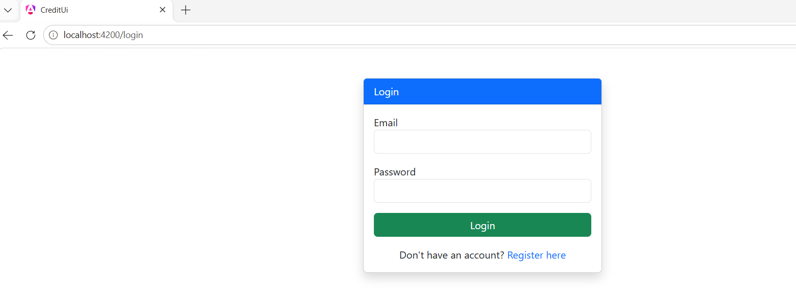
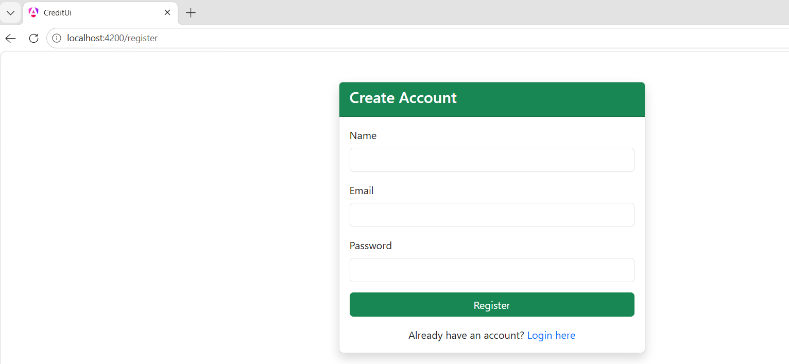
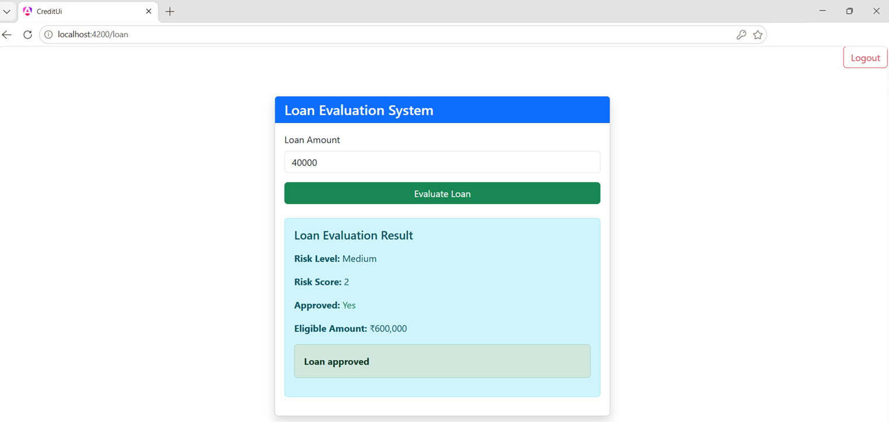
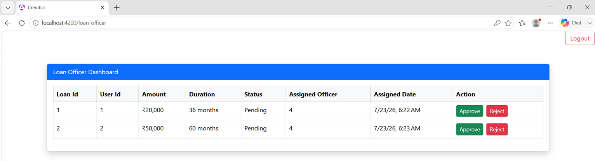
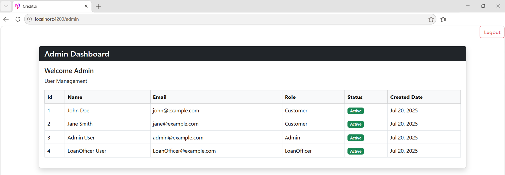

# Credit Decision Engine — Full Stack Banking Workflow Application

A modern full-stack banking workflow application built using **ASP.NET Core**, **Angular**, and **Clean Architecture** principles.

The application simulates an enterprise loan processing system where customers can evaluate loan eligibility, submit loan applications, and authorized users manage the loan review process through secure role-based workflows.

---

## Tech Stack

* ASP.NET Core Web API (.NET 9)
* Angular 21 (Standalone Components)
* Entity Framework Core
* SQL Server
* JWT Authentication
* Role-Based Authorization
* BCrypt Password Hashing
* FluentValidation
* Docker
* Clean Architecture

---

## Solution Structure

```text
CreditDecisionEngine/
├── CreditDecisionEngine.API
├── CreditDecisionEngine.Application
├── CreditDecisionEngine.Domain
├── CreditDecisionEngine.Infrastructure
├── CreditDecisionEngine.UI
```

---

## Features

### Authentication & Security

* User registration and login
* JWT authentication
* Refresh token support
* Role-based authorization
* Protected API endpoints
* Angular route guards and HTTP interceptor

### Customer Features

* Loan eligibility evaluation
* Credit risk assessment (Low, Medium, High)
* Eligible loan amount calculation
* Loan application submission

### Loan Officer Features

* View pending loan applications
* Assign loan review
* Approve loan applications
* Reject loan applications

### Admin Features

* Admin dashboard
* View registered users
* User management foundation for future CRUD operations

### Architecture

* Clean Architecture implementation
* Entity Framework Core data access
* RESTful API design
* Standardized API response model
* Docker-ready deployment

---

## Current Workflow

```text
Customer
    │
    ▼
Loan Evaluation
    │
    ▼
Loan Application
    │
    ▼
Loan Officer Review
    │
    ▼
Approve / Reject
```

---

## Business Rules

The credit evaluation engine assesses loan applications using:

* Customer income
* Existing debt
* Credit score
* Debt-to-income ratio
* Requested loan amount

The system determines:

* Loan approval eligibility
* Credit risk level
* Maximum eligible loan amount

---

## Screenshots

### API


### Angular UI

#### Login Screen


#### Register Screen


#### Loan Evaluation Screen


#### Loan Officer Screen


#### Admin Screen


### Solution Structure


---

## Roadmap

### Completed

* JWT Authentication
* Refresh Token implementation
* Role-Based Authorization
* Customer Loan Evaluation
* Loan Application Persistence
* Loan Officer Workflow
* Admin User Listing
* Angular Standalone UI
* Clean Architecture implementation

### In Progress

* User Management (Create, Update, Activate/Deactivate Users)

### Planned

* Loan history
* Approval remarks and audit trail
* Reporting dashboards
* Notifications
* API Gateway
* Microservices architecture
* Event-driven processing
* Redis caching
* AI-assisted credit risk prediction

---

## Status

The project is under active development with new enterprise features being added incrementally through planned development sprints.

Interested in learning more or reviewing the implementation? Please [Contact me](mailto:path2devhub@gmail.com) for an architecture walkthrough or demonstration.
