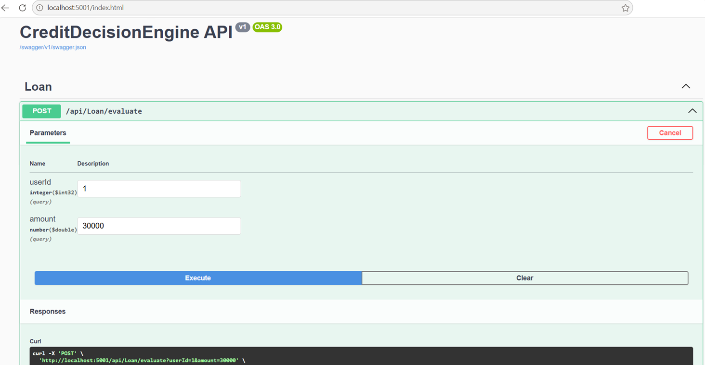
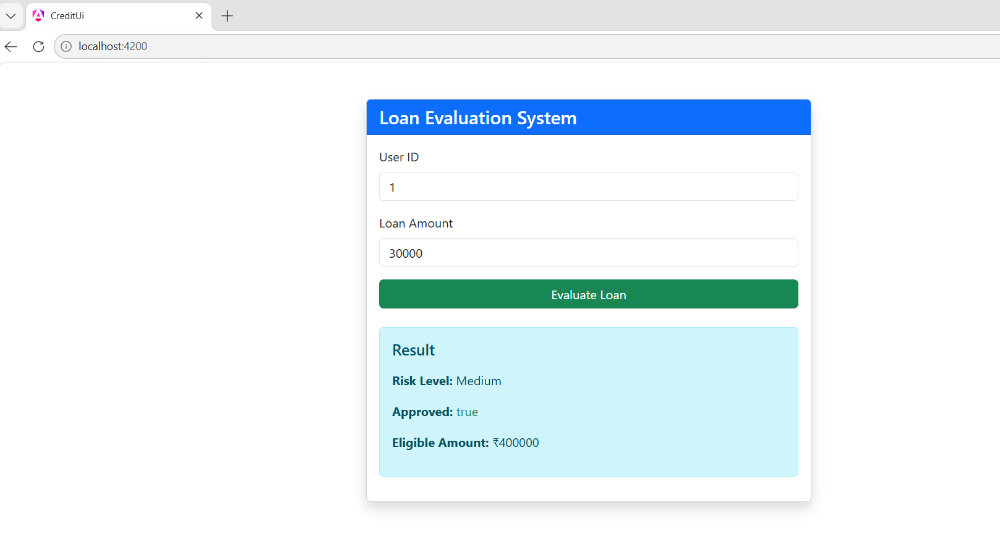
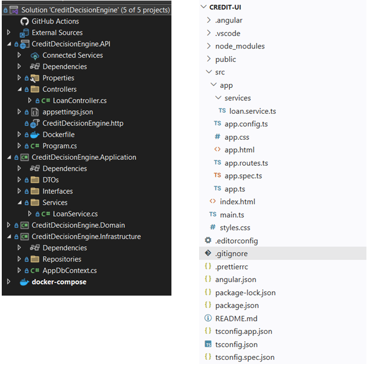

# Credit Decision Engine — Loan Evaluation System

A modern full-stack loan evaluation system built using **Clean Architecture** principles. The application assesses loan applications based on customer financial profiles and applies rule-based credit evaluation to determine approval status, risk level, and eligible loan amount.

---

## Tech Stack

- .NET 9 (ASP.NET Core Web API)
- Angular
- Entity Framework Core
- SQL Server (SQL-ready / InMemory for development)
- Docker
- Clean Architecture

---

## Solution Structure

```text
CreditDecisionEngine/
├── CreditDecisionEngine.API
├── CreditDecisionEngine.Application
├── CreditDecisionEngine.Domain
├── CreditDecisionEngine.Infrastructure
├── CreditDecisionEngine.UI
```

---

## Features

- Loan application evaluation based on customer financial profiles
- Rule-based credit decision engine
- Credit risk assessment (Low, Medium, High)
- Loan eligibility and approved amount calculation
- RESTful API built with ASP.NET Core
- Angular frontend for loan application evaluation
- Clean Architecture with clear separation of concerns
- Dockerized deployment

---

## Credit Decision Workflow

```text
Angular UI
      │
      ▼
ASP.NET Core Web API
      │
      ▼
Application Layer
(Business Rules)
      │
      ▼
Infrastructure Layer
(EF Core / Repositories)
      │
      ▼
Decision Result
      │
      ▼
Angular UI
```

---

## Business Rules

The system evaluates loan applications using:

- Customer income
- Existing debt
- Credit score
- Debt-to-income ratio
- Requested loan amount

It determines:

- Loan approval status
- Risk level
- Maximum eligible loan amount

---

## Screenshots

### API



### Angular UI



### Solution Structure



---

## Future Enhancements

- JWT Authentication
- Role-based access control
- SQL Server persistence
- Loan history
- Audit logging
- Event-driven processing with Kafka or RabbitMQ
- Redis caching
- Centralized logging and monitoring
- Microservices architecture

---

## Status

This project is under active development, and the source code is currently private due to ongoing enhancements and architectural refinement.

Interested in learning more or reviewing the implementation? Please [Contact me](mailto:path2devhub@gmail.com) for an architecture walkthrough or demonstration.
