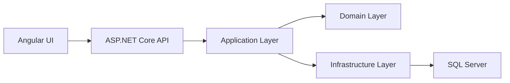
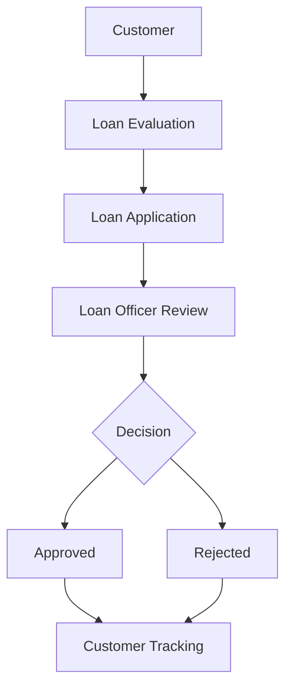
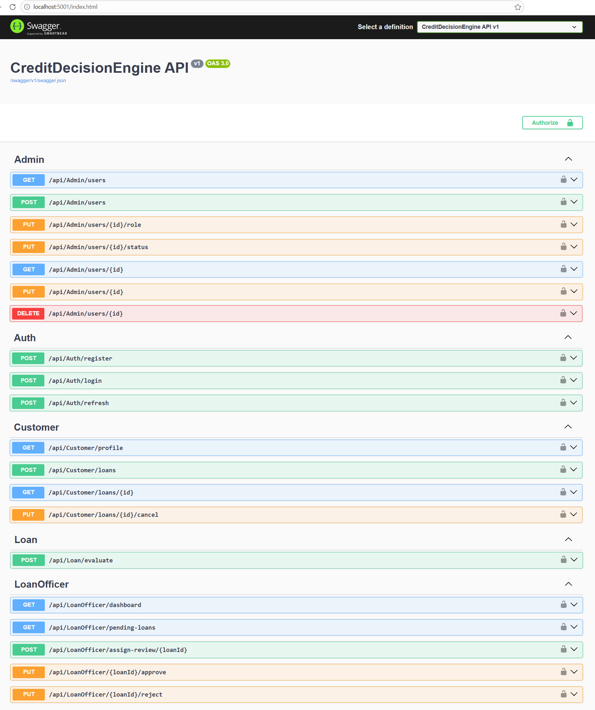
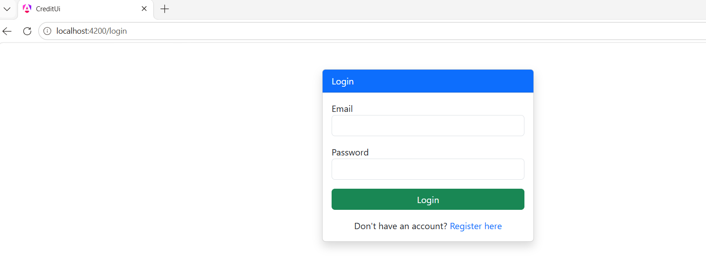
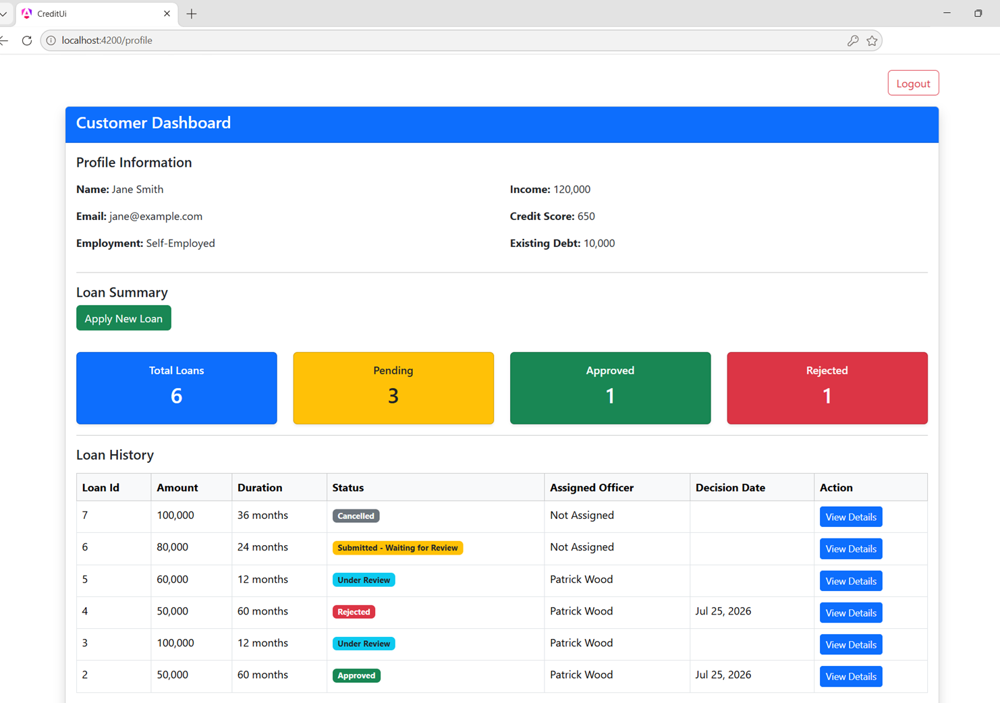
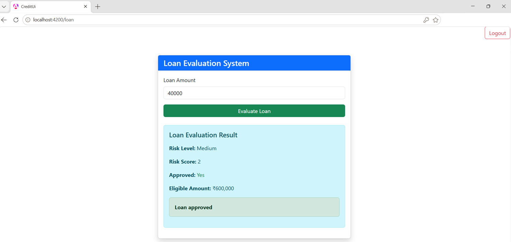
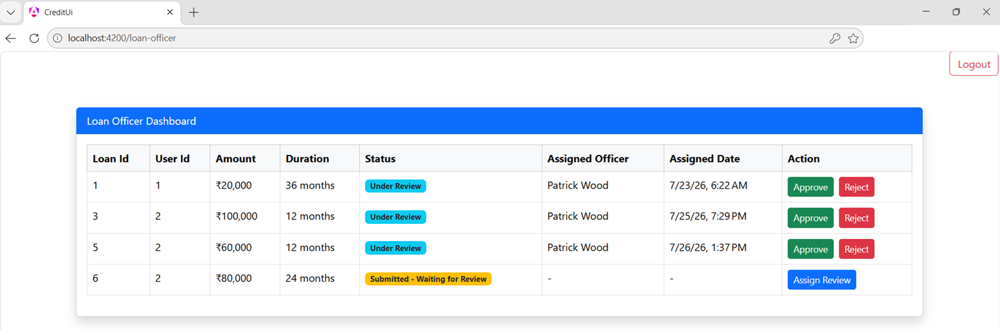
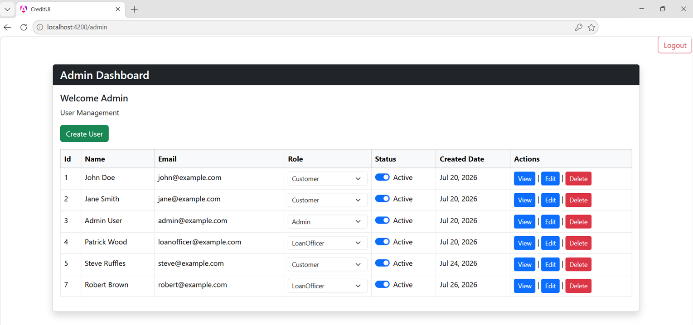
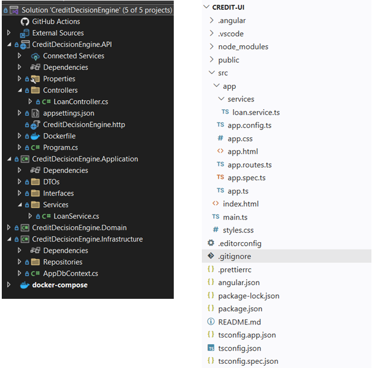

# Credit Decision Engine — Full Stack Banking Workflow Application

A modern full-stack banking workflow application built using **ASP.NET Core**, **Angular**, and **Clean Architecture** principles.

The application demonstrates an enterprise-style credit decision and loan management platform where customers can evaluate loan eligibility, submit loan applications, track application progress, and internal users can review and process loan applications through secure role-based workflows.

---

# Tech Stack

## Backend

- ASP.NET Core Web API (.NET 9)
- Entity Framework Core
- SQL Server
- Clean Architecture
- Repository Pattern
- JWT Authentication
- Refresh Token Rotation
- Role-Based Authorization
- BCrypt Password Hashing
- FluentValidation
- Global Exception Middleware

## Frontend

- Angular 21
- Standalone Components
- TypeScript
- Bootstrap 5
- Angular Router
- HTTP Interceptor
- Route Guards
- RxJS

## Deployment

- Docker support

---

# Solution Structure

```text
CreditDecisionEngine/

├── CreditDecisionEngine.API

├── CreditDecisionEngine.Application

├── CreditDecisionEngine.Domain

├── CreditDecisionEngine.Infrastructure

└── CreditDecisionEngine.UI
````

---

# Application Architecture

The application follows Clean Architecture principles.


```mermaid
flowchart LR

Angular["Angular UI"]

API["ASP.NET Core API"]

Application["Application Layer"]

Domain["Domain Layer"]

Infrastructure["Infrastructure Layer"]

Database["SQL Server"]


Angular --> API

API --> Application

Application --> Domain

Application --> Infrastructure

Infrastructure --> Database
```

Responsibilities:

| Layer          | Responsibility                              |
| -------------- | ------------------------------------------- |
| API            | Controllers, authentication, HTTP responses |
| Application    | Business logic, DTOs, services, validators  |
| Domain         | Entities and business rules                 |
| Infrastructure | Database access and persistence             |

---

# Features

## Authentication & Security

Implemented:

* User registration
* User login
* JWT authentication
* Refresh token support
* Secure password hashing
* Role-based authorization
* Protected API endpoints
* Angular authentication guards
* HTTP interceptor for JWT handling

Supported roles:

```
Admin

LoanOfficer

Customer
```

---

# Customer Features

Customers can manage their complete loan journey.

Implemented:

* Customer dashboard
* Customer profile information
* Credit profile display
* Income information
* Employment information
* Credit score display
* Existing debt information
* Loan statistics
* Loan application submission
* Loan history tracking
* Individual loan details view
* Loan status tracking
* Assigned loan officer information

Customer workflow:

```text
Customer Login

      |

Customer Dashboard

      |

Apply Loan

      |

Loan Application Submitted

      |

Loan History

      |

Loan Details Tracking

      |

Decision Status
```

---

# Loan Officer Features

Loan officers can review and process customer loan applications.

Implemented:

* Loan officer dashboard
* View pending loan applications
* Assign loan reviews
* View assigned applications
* Approve loan applications
* Reject loan applications
* Decision date tracking
* Assignment date tracking

Loan officer workflow:

```text
Loan Officer Login

        |

View Pending Applications

        |

Assign Review

        |

Review Application

        |

Approve / Reject

        |

Customer Status Update
```

---

# Admin Features

Admin functionality provides user administration capabilities.

Implemented:

* Admin dashboard
* User listing
* User details view
* User role management
* User activation/deactivation

Future enhancements:

* Advanced user auditing
* Bulk user operations
* Permission management

---

# Loan Processing Workflow


```mermaid
flowchart TD

Customer["Customer"]

Evaluate["Loan Evaluation"]

Apply["Loan Application"]

Review["Loan Officer Review"]

Decision{"Decision"}

Approved["Approved"]

Rejected["Rejected"]

Tracking["Customer Tracking"]


Customer --> Evaluate

Evaluate --> Apply

Apply --> Review

Review --> Decision

Decision --> Approved

Decision --> Rejected

Approved --> Tracking

Rejected --> Tracking
```

---

# Credit Decision Engine

The system evaluates credit applications using customer financial information.

Evaluation factors:

* Customer income
* Existing debt
* Credit score
* Debt-to-income ratio
* Requested loan amount

The engine calculates:

* Loan eligibility
* Risk classification
* Maximum eligible loan amount

Risk levels:

```
Low

Medium

High
```

---

# Backend APIs

Implemented API areas:

## Authentication

```
POST /api/auth/register

POST /api/auth/login

POST /api/auth/refresh
```

---

## Customer

```
GET /api/customer/profile

POST /api/customer/loans

GET /api/customer/loans/{loanId}
```

Provides:

* Customer profile
* Credit information
* Loan summary
* Loan history
* Loan details
* Assigned officer information

---

## Loan Evaluation

```
POST /api/loan/evaluate
```

---

## Loan Officer

```
GET /api/loanofficer/pending-loans

POST /api/loanofficer/assign-review/{loanId}

PUT /api/loanofficer/{loanId}/approve

PUT /api/loanofficer/{loanId}/reject
```

---

# Frontend Structure

```text
CreditDecisionEngine.UI

src/app

├── guards

├── interceptors

├── models

├── pages

│   ├── login

│   ├── register

│   ├── customer-profile

│   ├── apply-loan

│   ├── loan-details

│   ├── loan-officer

│   └── admin

│

├── services

│   ├── auth.service.ts

│   ├── customer.service.ts

│   ├── loan.service.ts

│   ├── loan-officer.service.ts

│   └── admin.service.ts

└── app.routes.ts
```

---

# Screenshots

## API



## Angular UI

### Login



### Customer Dashboard



### Loan Evaluation



### Loan Officer Dashboard



### Admin Dashboard



### Solution Structure



---

# Development Roadmap

## Completed

### Authentication & Security

* JWT authentication
* Refresh token rotation
* BCrypt password hashing
* Role-based authorization
* Protected routes

### Customer Workflow

* Loan evaluation
* Customer dashboard
* Customer profile retrieval
* Credit profile display
* Loan application submission
* Loan history
* Loan details tracking
* Assigned officer visibility

### Loan Officer Workflow

* Pending loan dashboard
* Loan assignment
* Approval workflow
* Rejection workflow
* Decision tracking

### Frontend

* Angular standalone architecture
* Route guards
* HTTP interceptor
* Role-based navigation
* Customer workflow screens
* Loan officer workflow screens

### Backend Architecture

* Clean Architecture
* DTO-based communication
* FluentValidation
* Repository pattern
* Global exception handling
* Standard API response format

---

# Future Enhancements

## Advanced Loan Processing

Planned:

* Approval comments
* Rejection reasons
* Decision history
* Audit logging
* Loan review details page

---

## Customer Banking Features

Planned:

* Email notifications
* Document upload
* EMI schedule generation
* Loan repayment tracking
* Payment history
* Credit bureau integration

---

## Enterprise Architecture

Planned:

* API Gateway
* Dedicated Authentication Service
* User Service extraction
* Loan Service extraction
* Event-driven architecture
* Redis caching
* Analytics dashboard
* AI-assisted credit risk prediction

---

# Running the Application

## Backend

Open:

```
CreditDecisionEngine.sln
```

Run:

```bash
dotnet run
```

---

## Angular

Install dependencies:

```bash
npm install
```

Run:

```bash
ng serve
```

Application:

```
http://localhost:4200
```

---

# Docker

Build:

```bash
docker-compose build
```

Run:

```bash
docker-compose up
```

---

# Status

The Credit Decision Engine is an actively developed enterprise-style banking workflow application demonstrating secure authentication, role-based authorization, customer loan management, loan officer processing workflows, and modern full-stack architecture using ASP.NET Core and Angular.

The platform currently supports complete customer and loan officer workflows, with ongoing enhancements focused on enterprise capabilities such as auditing, notifications, advanced loan processing, and scalable service architecture.

Interested in learning more or reviewing the implementation? Please [Contact me](mailto:path2devhub@gmail.com) for an architecture walkthrough or demonstration.
