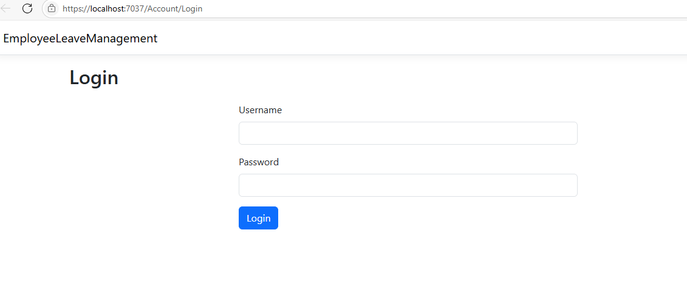
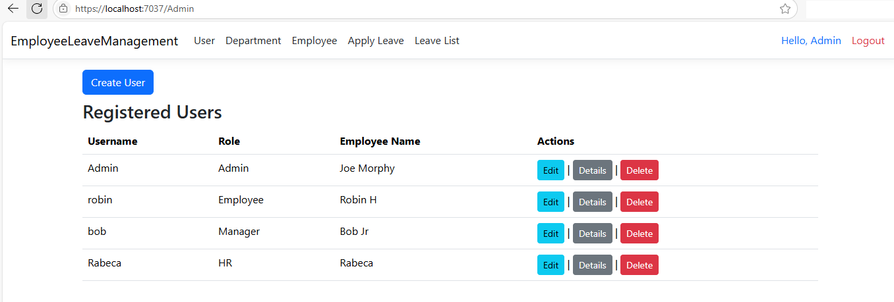
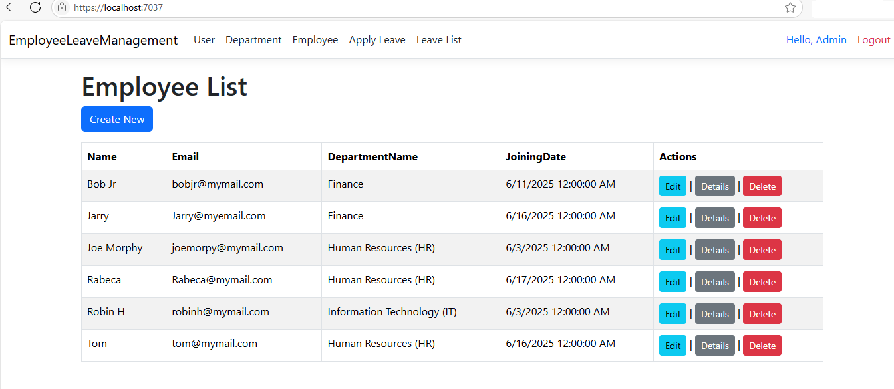
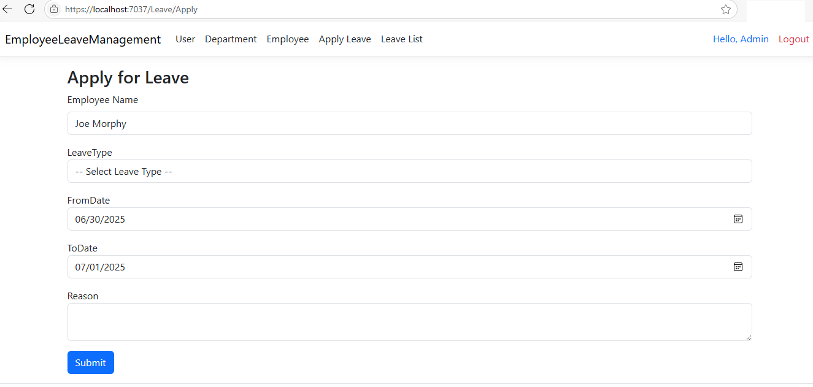
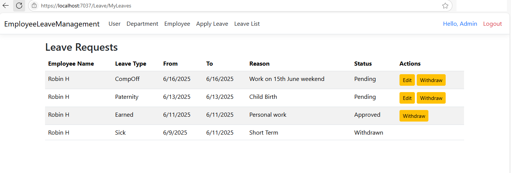

# Employee Leave Management System

A robust leave workflow management system using **ASP.NET Core MVC**, **C#**, and **SQL Server**, offering full role-based access and user management.

---

### Tech Stack
- ASP.NET Core MVC
- C#
- MS SQL Server
- Bootstrap + jQuery (optional UI enhancements)

---

### Features
- Role-based login (Admin, Manager, HR, Employee)
- Leave application, editing, and withdrawal
- Manager/Admin approval flow
- Admin dashboard for user/leave management
- Password reset on first login
- Soft-delete system for inactive users

---

### Screenshot
Login:

---
User:

---
Employee:

---
Leave:

---
Leave Request:

---

---

### Status
Code is currently private and being polished.  
Interested in viewing more? [Contact me](mailto:path2devhub@gmail.com).