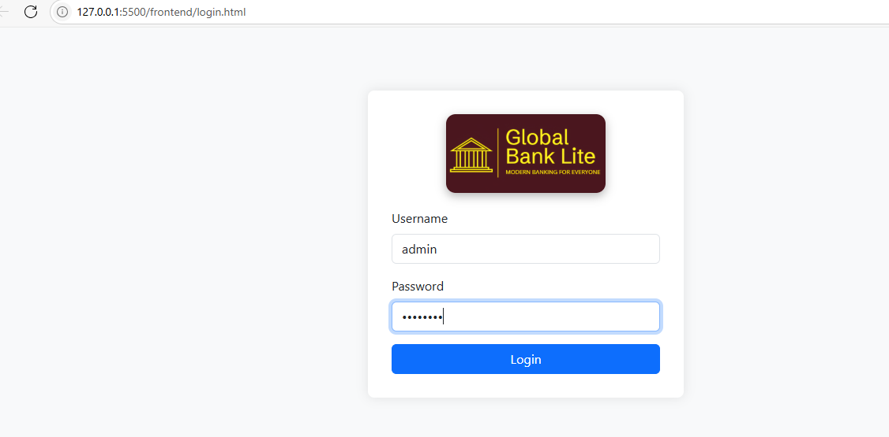
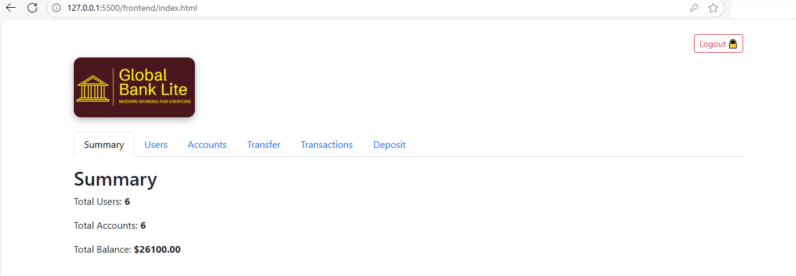
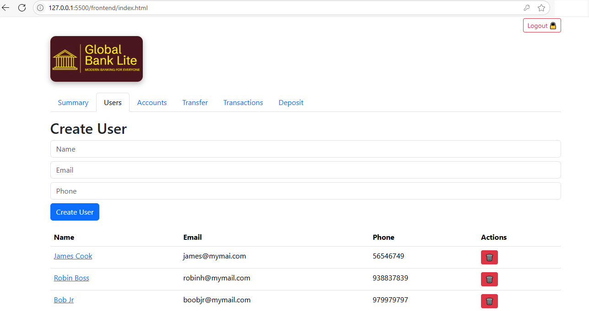
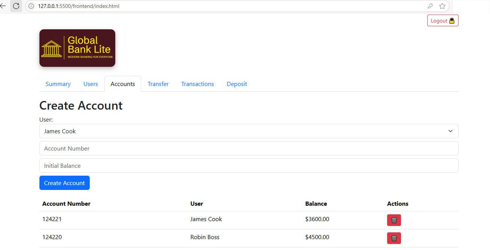
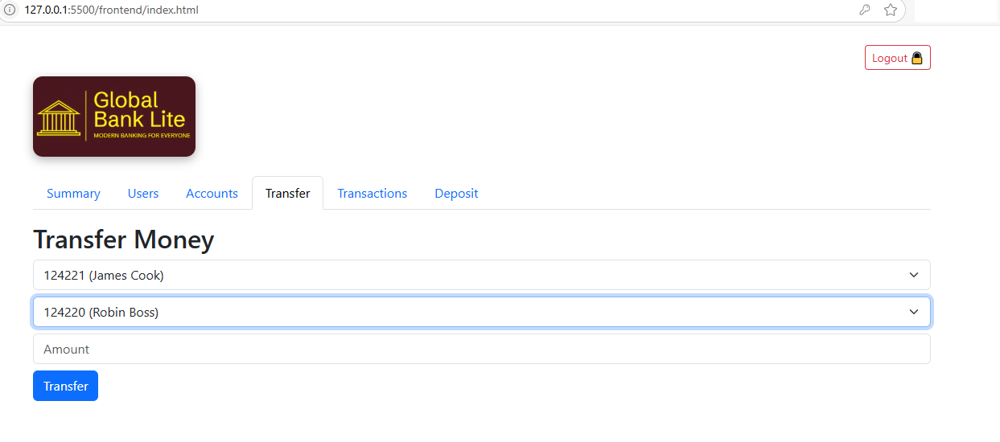
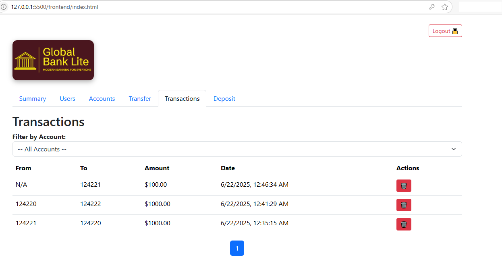
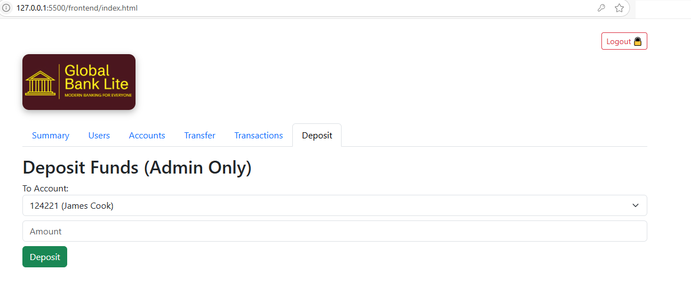

# Global Bank Lite — Mini Banking App

A lightweight and modular banking system built with **Node.js**, **MongoDB**, and **Bootstrap**, with a responsive front-end and secure account management.

---

### Tech Stack
- Node.js + Express.js
- MongoDB (Mongoose)
- Bootstrap 5, jQuery
- Modular ES6 structure

---

### Features
- Admin/user login
- Account creation with opening balance
- Fund transfer between accounts
- Transaction history per account
- Deposit-only feature for Admin
- Pagination, filtering, form validation
- Modular front-end JS (ES Modules)

---

### Project Structure
```
GlobalBankLite/
├── backend/
│ ├── controllers/
│ ├── models/
│ ├── routes/
│ ├── config/
│ ├── app.js, server.js
├── frontend/
│ ├── login.html, index.html
│ ├── css/, js/modules/, public/

```
---

### Screenshot
Login:

---
Summery:

---
User:

---
Account:

---
Transfer:

---
Trasaction:

---
Deposit Fund:

---

---

### Status
Feature complete; UI refinements in progress. Source is private.  
For a walkthrough or live demo, [reach out](mailto:path2devhub@gmail.com).