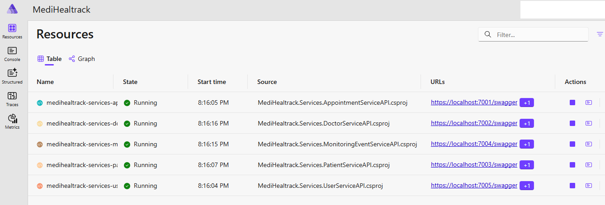
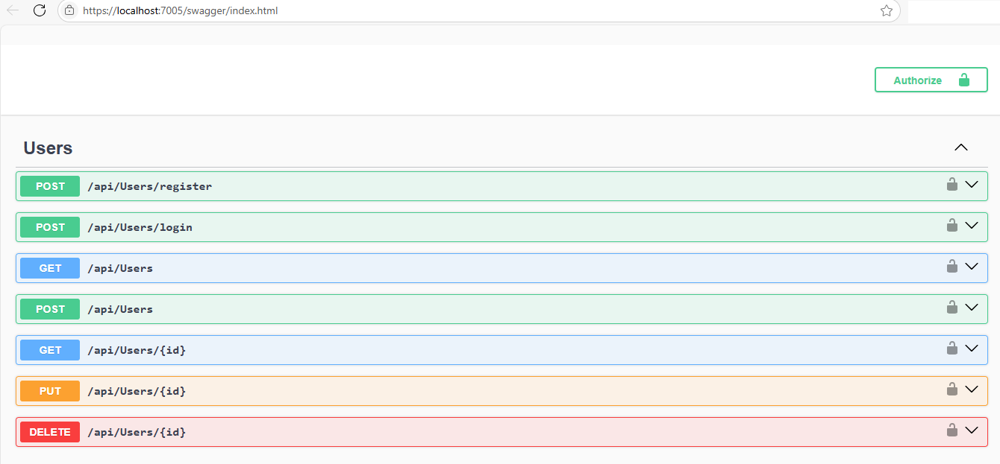
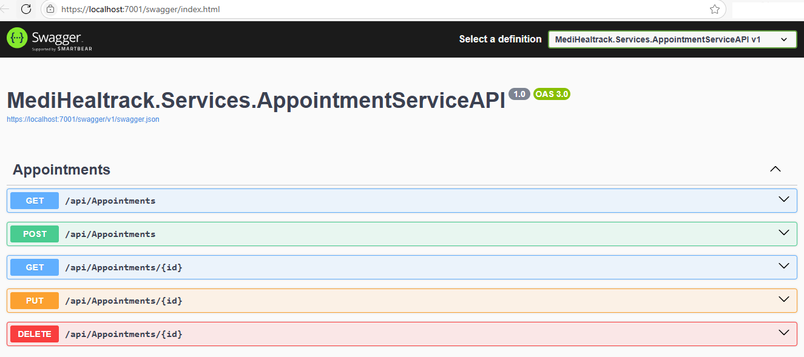

# MediHealtrack — Patient Appointment & Monitoring System

A distributed healthcare system designed using **Clean Architecture** and **Microservices** principles. Built with **.NET Core 9 (C#)**, **Apache Kafka**, **Angular**, and managed with **Docker containers**.

---

### Tech Stack
- .NET Core 9 (C#)
- Angular
- MS SQL Server
- Apache Kafka
- Aspire.Hosting.AppHost
- Docker

---

### Services & Structure

```
MediHealtrack/
├── AppHost # Orchestration layer
├── Model # Shared DTOs and models
├── AppointmentServiceAPI # Manages scheduling and bookings
├── DoctorServiceAPI # Doctor profiles & availability
├── MonitoringEventServiceAPI # Tracks real-time health metrics
├── PatientServiceAPI # Patient profiles and medical records
├── UserServiceAPI # Authentication and access control

```

---

### Features
- Patient appointment booking and management
- Real-time health monitoring via event-driven architecture
- Doctor-patient messaging and scheduling
- Role-based access control (patients, doctors, admins)
- Asynchronous microservice communication using Kafka

---

### Screenshots

AppHost:

---
User Service API:

---
Appointment Service API:

---

### Status
This project is under active development and the codebase is currently private.  
Want to know more [Contact me](mailto:path2devhub@gmail.com).
