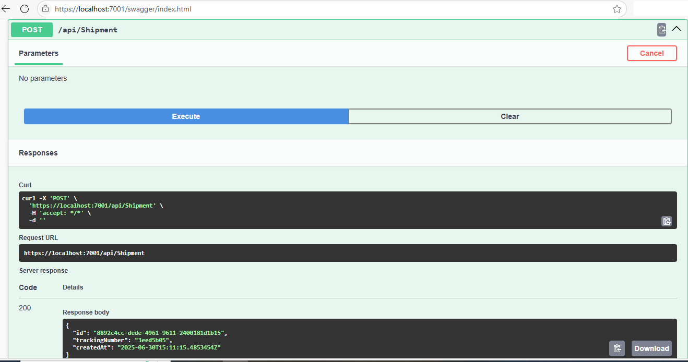
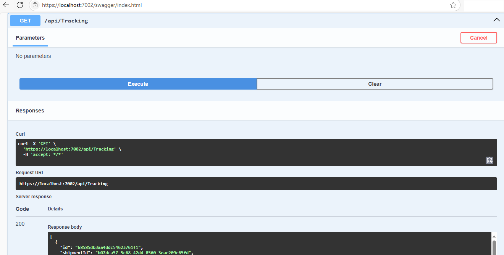
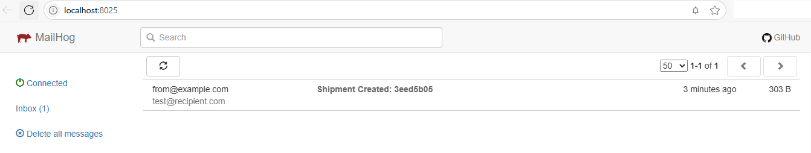

 # Routenixo — Logistics & Shipment Tracking System

**Routenixo** is a modular and scalable logistics platform built using microservices, with asynchronous messaging handled by **MassTransit + RabbitMQ** and **Kafka** variants. Designed using **.NET 9**, **MongoDB**, and **SQL Server** for hybrid data needs.

---

### Tech Stack
- .NET 9 (C#)
- RabbitMQ (via MassTransit)
- Kafka (via MassTransit.Kafka & Confluent.Kafka)
- SQL Server
- MongoDB
- Docker

---

### Microservices Overview

| Service              | Description                                             |
|----------------------|---------------------------------------------------------|
| `ShipmentService`    | Creates and tracks shipment records (SQL Server)        |
| `TrackerService`     | Updates tracking events, logs to MongoDB                |
| `NotificationService`| Sends email alerts via Mailhog/SMTP on key events       |

---

### Features
- Event-driven architecture for shipment lifecycle
- Multiple transport layers: RabbitMQ, Kafka (toggleable)
- MongoDB + SQL hybrid persistence
- Clean separation of concerns for future extensibility
- Email notifications for delivery updates

---

### Screenshots

Shipment Service API:

---
Tracking Service API:

---
Notification Service API:

---

---

### Status
Actively developing and testing multiple transport pipelines (RabbitMQ/Kafka).  
Source is private but available upon request