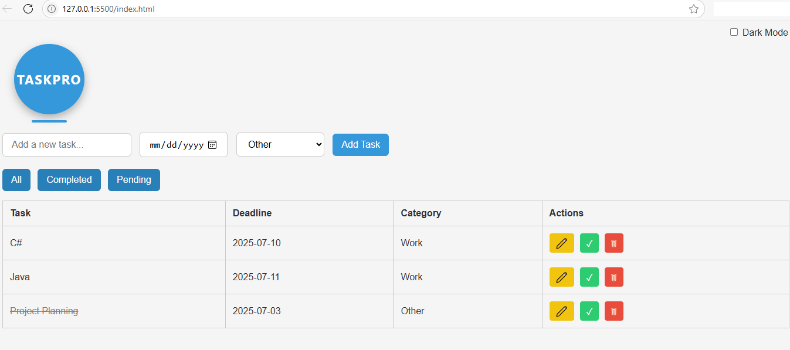

# TaskPro — Simple & Effective Task Manager

**TaskPro** is a lightweight productivity app built using **HTML, CSS, and JavaScript**, featuring dark mode, inline editing, and local storage for offline use.

---

### Tech Stack
- HTML5 + CSS3
- Vanilla JavaScript (ES6+)
- LocalStorage API

---

### Features
- Add, edit, delete tasks
- Task categorization: Work, Personal, Urgent, Other
- Filter: All, Completed, Pending
- Inline editing with keyboard shortcut (Enter = save, Esc = cancel)
- Dark Mode toggle
- Tasks persist in localStorage (no backend required)

---

### Screenshot
TaskPro:

---

---

### Status
Fully functional, open for enhancements. Want a demo? [Let’s talk](mailto:path2devhub@gmail.com).